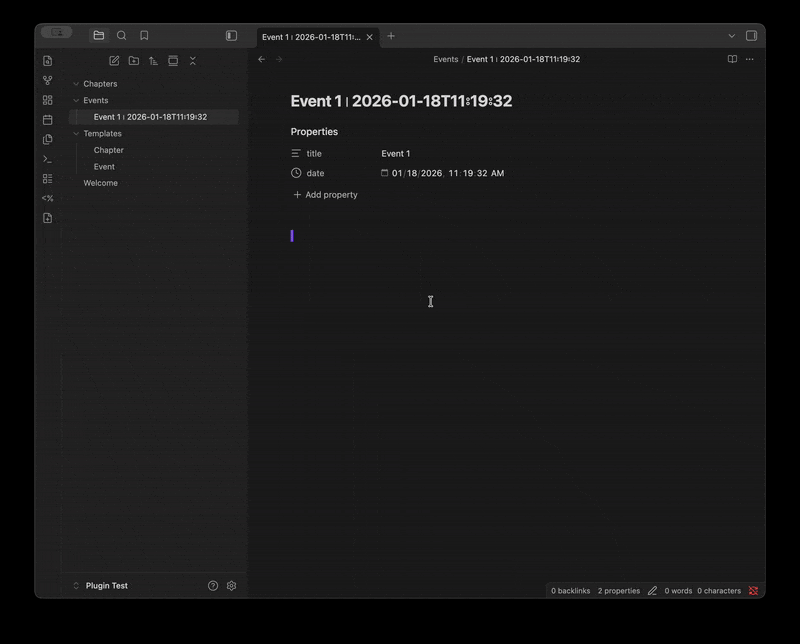

# New File Templates for Obsidian



Create new notes with templated titles and optional file content templates. Quickly generate consistently named files from the command palette, context menu, keyboard shortcut, or ribbon icon. 

## Features

- **Title Templates**: Define patterns for generating filenames with date/time variables
- **User Prompts**: Add dynamic input fields (``) that are filled in at file creation time
- **Syntax Highlighting**: Visual highlighting for prompt syntax in the editor and settings
- **Autocomplete**: Smart suggestions when typing `{%` for prompts or `{{` for variables
- **File Templates**: Optionally apply content templates to new files (with variable substitution)
- **Templater Integration**: Automatically process Templater syntax in your file templates
- **Obsidian Integration**: Uses your configured date/time formats from Obsidian's core Templates plugin
- **Template Reordering**: Drag and drop or use arrow buttons to arrange templates in your preferred order
- **Multiple Access Methods**:
  - Command palette: "Create New Templated File"
  - Per-template commands: "Create a new {Template Name} File"
  - Right-click folder context menu
  - Ribbon icon (sidebar)
- **Flexible Folder Targeting**: Set a default folder or use the current folder
- **Searchable Selection**: Search through folders and template files in settings
- **Smart Filename Sanitization**: Automatically handles invalid filename characters
- **Mobile Support**: Fully optimized for iOS and Android

## Installation

### From Obsidian Community Plugins (Recommended)
Note: This plugin hasn't been submitted yet, so this isn't available.
1. ~~Open Settings → Community Plugins~~
2. ~~Search for "New File Templates"~~
3. ~~Click Install, then Enable~~

### BRAT Installation (for beta testing)
1. Open Settings -> Community Plugins
2. Search for "BRAT"
3. Install, Enable the plugin, and open BRAT settings.
4. Find the button that say "Add Beta Plugin" and click it.
5. Enter the address of this repo and install it: https://github.com/ahayman/ObsidianNewFileTemplates
6. Make sure the New Files Template plugin is enabled.

### Manual Installation
1. Download `main.js`, `manifest.json`, and `styles.css` from the latest release
2. Create folder: `<vault>/.obsidian/plugins/new-file-templates/`
3. Copy the files into this folder
4. Reload Obsidian and enable the plugin in Settings → Community Plugins

## Usage

### Creating Templates

1. Open Settings → New File Templates
2. Click "Add Template"
3. Configure your template:
   - **Name**: Display name (e.g., "Daily Note")
   - **Title Pattern**: Filename pattern with variables (e.g., `{{date}}-daily`)
   - **Target Folder**: Where to create files (or "Current Folder")
   - **File Template**: Optional content template file

### Reordering Templates

Templates appear in the order you arrange them, both in settings and when selecting a template:

- **Drag and Drop**: Use the grip handle on the left to drag templates to a new position
- **Arrow Buttons**: Use the up/down arrows to move templates one position at a time
- On mobile, the arrow buttons are always visible for easy reordering

### Title Pattern Variables

The plugin integrates with Obsidian's core Templates plugin. If you have date/time formats configured there, they will be used automatically.

| Variable | Description | Default Format |
|----------|-------------|----------------|
| `{{date}}` | Current date | YYYY-MM-DD |
| `{{date:FORMAT}}` | Date with custom format | Any moment.js format |
| `{{time}}` | Current time (12-hour) | h:mm:ss A |
| `{{time:FORMAT}}` | Time with custom format | Any moment.js format |
| `{{datetime}}` | Combined date and time | YYYY-MM-DDTHH:mm:ss |
| `{{timestamp}}` | Unix milliseconds | 1710513045000 |
| `{{year}}` | Current year | YYYY |
| `{{month}}` | Current month (zero-padded) | MM |
| `{{day}}` | Current day (zero-padded) | DD |
| `{{counter}}` | Auto-incrementing number | Scans folder for max value |

**Custom Format Examples:**
- `{{date:MMMM D, YYYY}}` → "March 15, 2024"
- `{{date:dddd}}` → "Friday"
- `{{time:h-mm A}}` → "2-30 PM"

**Auto-Incrementing Counter:**

The `{{counter}}` variable automatically increments based on existing files in the target folder. When you create a new file:

1. The plugin scans the target folder for files matching your template pattern
2. Extracts the counter values from matching filenames
3. Uses the next value (max + 1)

When you add `{{counter}}` to your pattern, a "Counter Starts At" field appears in the template editor. This sets the initial value when no matching files exist (default: 1).

**Counter Examples:**
- Pattern: `Chapter {{counter}}` with existing files `Chapter 1.md`, `Chapter 2.md` → Creates `Chapter 3.md`
- Pattern: `{{counter}} - {{date}} Meeting` → Creates `1 - 2024-03-15 Meeting.md`, `2 - 2024-03-15 Meeting.md`, etc.
- Pattern: `Note {{counter}}` with "Starts At: 100" and no existing files → Creates `Note 100.md`

Note: `{{counter}}` can only be used once per template pattern.

### User Prompts

User prompts let you add dynamic input fields that are filled in when creating a new file. Unlike built-in variables which are auto-generated, prompts ask you for a value at file creation time.

**Basic Syntax:** ``

**Inline Configuration Syntax:** ``

You can configure prompt type and format directly in the syntax:

| Syntax | Description |
|--------|-------------|
| `` | Basic text prompt |
| `` | Explicit text type |
| `` | Numeric input |
| `` | Date with ISO format |
| `` | Time with 12-hour format |
| `` | DateTime with date and time formats |
| `` | Custom format |

**Optional Prompts:** ``

Optional prompts don't require a value. If left empty, an empty string is used:

| Syntax | Description |
|--------|-------------|
| `` | Optional text field |
| `` | Optional with explicit type |
| `` | Optional date with format |
| `-` | Mixed required and optional |

Optional prompts show "(optional)" in the input form and pass validation even when empty.

**Adding Prompts to Templates:**

1. In the template editor, click "Add Prompt"
2. Configure the prompt name, value type, and optional status
3. Click "Insert" to add the prompt syntax to your title pattern

Or type the syntax directly using the inline configuration format.

**Value Types:**

| Type | Syntax Keyword | Description | Input Method |
|------|----------------|-------------|--------------|
| Text | `text` | Any text input | Text field |
| Numeric | `number` or `numeric` | Numbers only | Number keyboard on mobile |
| Date | `date` | Date selection | Calendar picker |
| Time | `time` | Time selection | Scrollable wheel picker |
| Date & Time | `datetime` | Both date and time | Calendar + time picker |

**Date Format Presets:**

Use these preset names in the syntax or configure in the prompt editor:

| Preset Name | Format | Example |
|-------------|--------|---------|
| `ISO` | YYYY-MM-DD | 2024-03-15 |
| `compact` | YYYYMMDD | 20240315 |
| `US` | MM-DD-YYYY | 03-15-2024 |
| `EU` | DD-MM-YYYY | 15-03-2024 |
| `short` | MMM DD, YYYY | Mar 15, 2024 |
| `long` | MMMM DD, YYYY | March 15, 2024 |
| `format(...)` | Custom | Any moment.js format |

**Time Format Presets:**

| Preset Name | Format | Example |
|-------------|--------|---------|
| `ISO` | HH:mm:ss | 14:30:45 |
| `24-hour` | HH:mm | 14:30 |
| `24-compact` | HHmm | 1430 |
| `12-hour` | h:mm A | 2:30 PM |
| `12-padded` | hh:mm A | 02:30 PM |
| `format(...)` | Custom | Any moment.js format |

**DateTime Format Examples:**

For datetime prompts, specify both date and time formats separated by comma:

| Syntax | Result |
|--------|--------|
| `` | 2024-03-15T14:30:45 |
| `` | 03-15-2024 2:30 PM |
| `` | 20240315 1430 |
| `` | Mar 15 2 PM |

**ISO DateTime Combination:**

When using Date & Time prompts, if both the date format is ISO (YYYY-MM-DD) and the time format is ISO (HH:mm:ss), they will be combined using `T` instead of a space, producing a standard ISO 8601 datetime like `2024-03-15T14:30:45`.

**Example Templates with Prompts:**

**Book Notes:**
- Pattern: ` - `
- Prompts: Author (text), Title (text)
- Result: `John Smith - My Book.md`

**Meeting Notes with Date:**
- Pattern: ` - `
- Prompts: Meeting Date (date, YYYY-MM-DD format), Topic (text)
- Result: `2024-03-15 - Project Review.md`

**Event Log:**
- Pattern: ` - `
- Prompts: Event Time (datetime), Event Name (text)
- Result: `2024-03-15 2:30 PM - Team Standup.md`

**Using the Same Prompt Multiple Times:**

If you use the same prompt name multiple times in a pattern, you only need to enter the value once:
- Pattern: `/-notes`
- Prompts: Author (text)
- User enters: "Jane Doe"
- Result: `Jane Doe/Jane Doe-notes.md`

**Optional Prompt Example:**

Create flexible templates where some fields are optional:
- Pattern: ``
- Prompts: Title (required), Subtitle (optional)
- With subtitle: `My Article - Part One.md`
- Without subtitle: `My Article.md`

### Syntax Highlighting & Autocomplete

The plugin provides syntax highlighting and autocomplete to help you write template patterns more easily.

**Main Editor (Prompt Syntax):**

When editing files that contain prompt syntax (``), you'll see:
- **Syntax Highlighting**: Prompts are visually distinguished with colored brackets, names, types, and formats
- **Autocomplete**: Type `{%` to trigger suggestions for:
  - Prompt templates (``, ``)
  - Value types (`text`, `number`, `date`, `time`, `datetime`)
  - Date format presets (`ISO`, `compact`, `US`, `EU`, `short`, `long`)
  - Time format presets (`ISO`, `24-hour`, `12-hour`, etc.)
  - Custom format option (`format(...)`)

**Custom Format Tokens:**

When using custom formats with `format(...)`, the plugin provides intelligent highlighting and autocomplete for moment.js tokens:

- **Token Highlighting**: Inside `format(...)`, moment.js tokens like `YYYY`, `MM`, `DD` are highlighted distinctly from literal text like `-` or `,`
- **Token Autocomplete**: Type inside `format(` to see suggestions for all moment.js format tokens with:
  - Token description (e.g., "4-digit year", "Full month name")
  - Live example based on current date/time
  - Context-aware ordering (date tokens appear first for date prompts, time tokens first for time prompts)
- **Live Preview**: As you type your format string, a preview at the top of the autocomplete shows the current date/time formatted with your pattern

**Common Format Tokens:**

| Token | Description | Example |
|-------|-------------|---------|
| `YYYY` | 4-digit year | 2024 |
| `MM` | Month (zero-padded) | 03 |
| `DD` | Day (zero-padded) | 15 |
| `MMMM` | Full month name | March |
| `MMM` | Abbreviated month | Mar |
| `dddd` | Full weekday | Friday |
| `HH` | Hour 24h (zero-padded) | 14 |
| `hh` | Hour 12h (zero-padded) | 02 |
| `mm` | Minutes (zero-padded) | 30 |
| `ss` | Seconds (zero-padded) | 45 |
| `A` | AM/PM uppercase | PM |

See the [moment.js format documentation](https://momentjs.com/docs/#/displaying/format/) for the complete list of tokens.

**Settings (Title Pattern Field):**

The title pattern input in settings provides enhanced editing:
- **Variable Highlighting**: `{{variable}}` syntax is highlighted, with invalid variables shown in red
- **Prompt Highlighting**: `` syntax is highlighted with the same colors as the main editor
- **Variable Autocomplete**: Type `{{` to see suggestions for all supported variables with descriptions
- **Prompt Autocomplete**: Type `{%` to see prompt syntax suggestions

**Note:** Prompts inside fenced code blocks (``` or ~~~) are not highlighted or processed, allowing you to document prompt syntax in your templates.

### File Template Variables

When you specify a file template, its content is processed with variable substitution (matching Obsidian's Templates plugin behavior):

| Variable | Description |
|----------|-------------|
| `{{title}}` | The generated filename (without extension) |
| `{{date}}` | Current date in your configured format |
| `{{date:FORMAT}}` | Date with custom moment.js format |
| `{{time}}` | Current time in your configured format |
| `{{time:FORMAT}}` | Time with custom moment.js format |

### File Prompts

You can also use prompt syntax (`` and ``) directly in your file template content. When creating a new file, any prompts found in the file template are displayed in a "File Prompts" section and replaced with the values you enter.

**Example file template with prompts:**

```markdown
# 

Author: 
Date: {{date}}

## Summary



## Notes

```

When you create a file using this template, you'll be prompted to enter values for "Project Name", "Author", and optionally "Summary". These values are substituted into the file content before any other processing.

**Processing Order:**
1. Prompts in file content are extracted
2. User enters values for both title prompts and file prompts
3. File prompts are substituted with values
4. File template variables ({{title}}, {{date}}, etc.) are processed
5. Templater syntax is processed (if enabled)
6. File is created

**Note:** Prompts inside fenced code blocks (``` or ~~~) are ignored and preserved as-is.

### Enter File Prompts Command

You can also process prompts in existing files using the **"Enter File Prompts"** command:

1. Open a file containing prompt syntax
2. Run the command from the command palette (`Ctrl/Cmd + P` → "Enter File Prompts")
3. Enter values for each prompt
4. The prompts are replaced with your values and the file is saved

If the file contains no prompts (outside of code blocks), a notification will let you know.

### Templater Integration

If you use the [Templater](https://github.com/SilentVoid13/Templater) plugin, this plugin can automatically process Templater syntax (`<% ... %>`) in your file templates when creating new notes.

**How it works:**

When you select a file template in the template editor, the plugin checks if it contains Templater syntax. Based on what it finds, you'll see one of:

| Scenario | What You'll See |
|----------|-----------------|
| Templater syntax detected, Templater installed | Toggle to enable/disable Templater processing |
| Templater syntax detected, Templater auto-processes on file creation | Info message: "Automatically processed by Templater" |
| Templater syntax detected, Templater NOT installed | Warning that Templater plugin is not installed |
| No Templater syntax | Nothing (no Templater options shown) |

**Setting Templater's auto-process option:**

Templater has a setting called "Trigger Templater on new file creation". If this is enabled, Templater will automatically process any new file, so this plugin won't need to trigger processing manually. If it's disabled, you can use the toggle in the template editor to control whether this plugin should process Templater syntax.

**Example file template with Templater:**

```markdown
---
title: <% tp.file.title.split(" ∣ ")[0] %>
date: <% tp.file.title.split(" ∣ ")[1].replaceAll("⦂", ":") %>
---

# <% tp.file.title.split(" ∣ ")[0] %>

<% tp.file.cursor() %>
```

When you create a new file with this template:
1. The file title is split on the divider, and then the first component is selected as the title.
2. The date is extracted from the title using the second component, and then "sanitized" back into an ISO format Obsidian understands by replacing the "⦂" symbol with a colon. This is necessary because colons aren't valid in file names, so we used a different symbol.

### Filename Sanitization

The plugin automatically handles characters that aren't allowed in filenames:

| Character | Replacement |
|-----------|-------------|
| `:` | `⦂` (two dot punctuation) |
| `\|` | `∣` (divides symbol) |
| `* " \ / < > ?` | Removed |

This allows you to use time formats like `{{time:HH:mm}}` in your patterns - the colons will be automatically converted to safe characters.

### Creating Files

**From Command Palette:**
- `Ctrl/Cmd + P` → "Create New Templated File" → Select template
- Or directly search for "Create a new {Template Name} File"

**From Folder Context Menu:**
- Right-click (or long-press on mobile) a folder
- Select "New Templated File"
- Choose your template

**From Ribbon:**
- Click the file-plus icon in the left sidebar

### Example Templates

**Daily Note:**
- Name: `Daily Note`
- Pattern: `{{date}}-daily`
- Folder: `Daily Notes`
- Result: `2024-03-15-daily.md`

**Meeting Notes:**
- Name: `Meeting Notes`
- Pattern: `{{date}}_{{time}}-meeting`
- Folder: `Meetings`
- Result: `2024-03-15_14-30-45-meeting.md`

**Timestamped Note with Custom Format:**
- Name: `Quick Note`
- Pattern: `{{date:YYYYMMDD}}-{{time:HHmmss}}`
- Folder: `Current Folder`
- Result: `20240315-143045.md`

**Weekly Review:**
- Name: `Weekly Review`
- Pattern: `{{date:YYYY}}-W{{date:ww}}-review`
- Folder: `Reviews`
- Result: `2024-W11-review.md`

**Book Chapter:**
- Name: `Book Chapter`
- Pattern: `Chapter {{counter}} - {{date}}`
- Folder: `Book`
- Counter Starts At: `1`
- Result: `Chapter 1 - 2024-03-15.md`, `Chapter 2 - 2024-03-15.md`, etc.

## Development

### Prerequisites
- Node.js 18+
- Yarn

### Setup
```bash
git clone <repo-url>
cd ObsidianNewNoteTemplate
yarn install
```

### Commands
```bash
yarn build      # Production build
yarn dev        # Development with watch mode
yarn test       # Run tests
yarn test:watch # Run tests in watch mode
```

### Project Structure
```
src/
├── main.ts           # Plugin entry point
├── types.ts          # TypeScript interfaces
├── utils/            # Template parsing utilities
├── services/
│   ├── FileService.ts      # File operations
│   ├── TemplaterService.ts # Templater plugin integration
│   └── CounterService.ts   # Auto-increment counter logic
├── modals/           # Template selection modal
└── settings/         # React-based settings UI
```

### Testing in Obsidian
1. Create a test vault (don't use your main vault!)
2. Create symlink or copy build output:
   ```bash
   # macOS/Linux
   ln -s /path/to/project /path/to/vault/.obsidian/plugins/new-file-templates

   # Or copy files
   cp main.js manifest.json styles.css /path/to/vault/.obsidian/plugins/new-file-templates/
   ```
3. Reload Obsidian (`Ctrl/Cmd + R`) or `Ctrl/Cmd + p` and search for the `Reload app without saving` command.

## License

MIT License - See [LICENSE](LICENSE) for details.

## Support

- [Report Issues](https://github.com/your-repo/issues)
- [Feature Requests](https://github.com/your-repo/issues)
